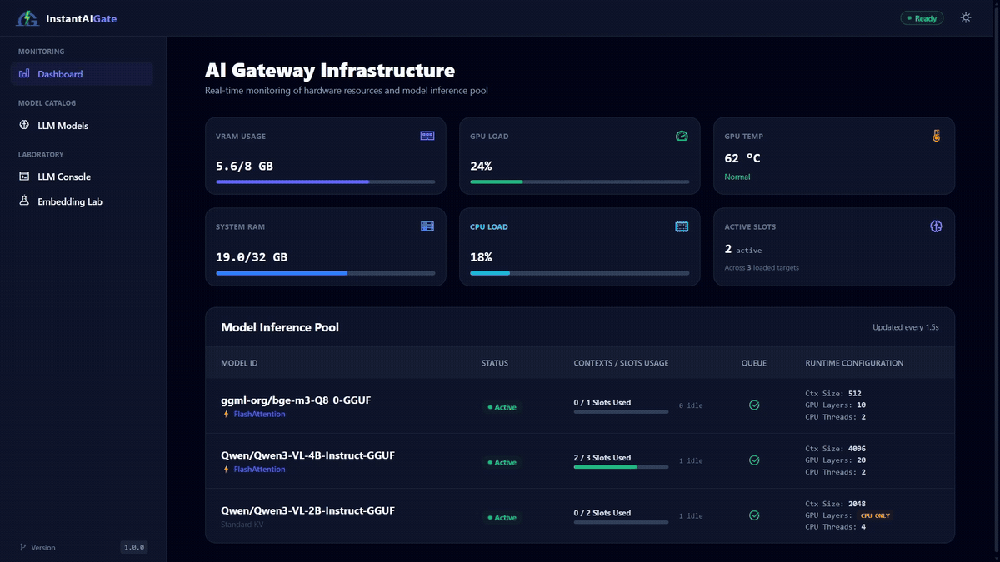
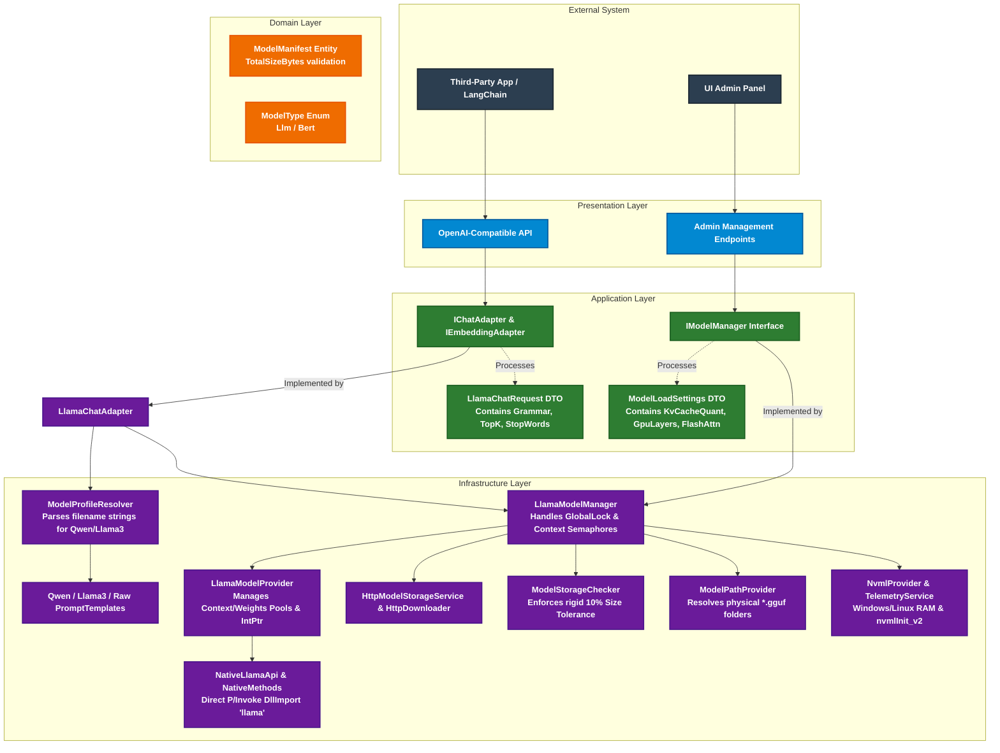

  
   
  <strong>Standardized. Secure. Instant Deployment.</strong>
   
  Lightweight middleware providing a self-hosted, monitored foundation for local AI applications.

  <a href="README.md"><b>Overview</b></a> │ 
  <a href="INSTALLATION.md"><b>Installation Guide</b></a> │ 
  <a href="DATASHEET.md"><b>Technical Data Sheet</b></a>

  
  
  
  
  

---

## What is InstantAIGate?

**InstantAIGate** is a ready-to-use infrastructure building block (middleware) for securely integrating local Large Language 
Models (LLMs) into modern digital products, applications, and internal organizational services. It provides an isolated server-side 
solution, a built-in administration dashboard (UI), and a seamless bridge between your application logic and model weights. Furthermore, 
the platform enables fine-grained configuration of model parameters, putting total control over inference.

  

## Key Enterprise Features

* **🛡️ Data Sovereignty & Security Compliance**
  Operates 100% within your private network perimeter (On-Premise / Private Cloud). Your data never leaves the organization's control,
  eliminating the risk of trade secret leaks and ensuring strict compliance with enterprise security requirements.

* **🔌 Standardized OpenAI-Compatible API Interface**
  The platform exposes a standardized API fully compatible with the OpenAI specification. This allows development teams to seamlessly route
  existing application workflows to locally hosted models by simply updating the `base_url`. It eliminates vendor lock-in and provides an immediate
  infrastructure alternative for environments requiring localized data processing.

* **🔄 Resource Pooling & Zero-Downtime Hot-Swap**
  Dynamic orchestration of model weight pools and contexts allows you to switch active models on the fly via API or the admin UI without restarting the server.
  Depending on available hardware resources, you can efficiently keep embedding models, background task processors, and conversational LLMs in memory simultaneously,
  ensuring seamless routing and zero interruption for users.

* **📊 Production-Grade Control & Resource Tuning**
  A comprehensive, out-of-the-box web interface designed for both infrastructure management and testing. It provides real-time model status monitoring
  and secure weight downloads visualized via Server-Sent Events (SSE). Crucially, the UI unlocks granular control over server resources and concurrent user sessions,
  enabling you to run specific background LLM tasks strictly on the CPU. This hybrid resource allocation maximizes hardware efficiency and dramatically reduces overall
  infrastructure costs.

## Technical Architecture & High-Level Design

**InstantAIGate** is built on **Domain-Driven Design (DDD)** principles, cleanly separating core business logic from infrastructural details. The architecture ensures modularity, testability, and high performance. 

The core interaction identifier is the **RepoId** (e.g., `"Qwen/Qwen3-VL-2B-Instruct-GGUF"`). The presentation layer and external APIs remain entirely agnostic of physical disk paths, file extensions, or storage formats.

| Layer | Business Value / Responsibility | Key Components (what to look for) |
|-------|--------------------------------|-----------------------------------|
| **Presentation / API** | Enables fast integration and migration with minimal app changes; enforces protocol compatibility, authentication, and SLA-facing metrics (latency, error rate). Low risk for app teams: swap base_url and use local models. | OpenAI-compatible REST endpoints, Admin management endpoints (Admin_API), Server-Sent Events (SSE) telemetry broadcasters. |
| **Application** | Orchestrates model lifecycle to meet availability and cost targets; implements hot-swap, pooling and request routing so deployments scale without user disruption. Encapsulates operational policies (routing, concurrency caps, resource affinity). | ChatCompletionService (Orchestrator), ModelManager (State control & semaphores), PromptTemplateService (Token framing), ModelValidationService (Size & limits validation), core abstraction ports (IModelProvider, IModelStorageService, ITelemetryService). |
| **Domain / Contracts** | Single source of truth for product behavior and governance; preserves business invariants, model identity, and auditable manifests so changes are predictable and testable. | ModelManifest (Aggregate Root), RepoId (Strict Domain Value Object), ModelFile, ModelChecksum, ModelType taxonomy. |
| **Infrastructure** | Delivers secure, observable, and efficient execution of models (storage, downloads, native runtimes); implements enterprise controls for data locality, secure downloads, and hardware-aware scheduling to minimize costs. | LlamaModelProvider (Unmanaged core wrapper), HttpModelStorageService (.tmp network streams), NvmlProvider & TelemetryService (Raw OS/Hardware metrics), NativeLibraryLoader (Shadow copying & DLL bindings), InMemoryModelRegistry. |

## 🛠️ Tech Stack & Third-Party Licenses

InstantAIGate is built using modern, robust technologies on both the backend and frontend:

* **LLM Engine:** [llama.cpp](https://github.com/ggerganov/llama.cpp) (Native integration and drivers for high-performance GGUF inference)
* **Backend:** .NET 10, ASP.NET Core, OpenAI .NET Client (for API compatibility)
* **Frontend:** Bootstrap Icons, SignalR (for real-time communication)

⚖️ <b>View Third-Party License Information</b>

This project complies with all open-source licenses of its dependencies. 
Major dependencies, including **llama.cpp**, use permissive licenses such as **MIT** and **Apache 2.0**.

For the full, detailed list of third-party components, verification sources, and copyright notices, please refer to our dedicated [THIRD-PARTY-NOTICES.md](./THIRD-PARTY-NOTICES.md) file.

## 📄 License & Trademark
Copyright (c) 2026 Instancium (https://instancium.com). All rights reserved.

This project is licensed under the **Apache License 2.0** - see the [LICENSE](LICENSE) file for details.

### Branding & Logo Trademark

The **InstantAIGate** name, logos, and all branding assets located in any `media` directories (including root and web-project folders, e.g., inside `wwwroot`) are not covered by the Apache 2.0 license. 
Instead, all branding materials and logos throughout the project are licensed under the [Creative Commons Attribution-NonCommercial-NoDerivatives 4.0 International (CC BY-NC-ND 4.0)](https://creativecommons.org/licenses/by-nc-nd/4.0/).

You are welcome to use the logo to refer to this project, but you may not modify it or use it for commercial purposes or in a way that implies official endorsement without explicit permission.
